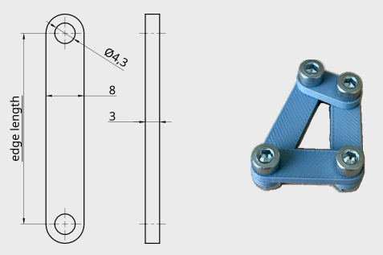

---
jupytext:
  text_representation:
    extension: .md
    format_name: myst
    format_version: 0.13
    jupytext_version: 1.16.4
kernelspec:
  display_name: Python 3 (ipykernel)
  language: python
  name: python3
---

# Mesh Generation of Graphs

+++

This notebook can be downloaded {download}`here <../../notebooks/mesh_generation.ipynb>`.

```{code-cell} ipython3
# The import will work if the package was installed using pip.
from pyrigi import Graph, Framework
```

Method {meth}`.Framework.generate_stl_bars` allows one to generate simple bars of a framework that can be 3D printed.

We start by creating a `Graph` and a `Framework`.


```{code-cell} ipython3
G = Graph([(0,1), (1,2), (2,3), (0,3)])
F = Framework(G, {0:[0,0], 1:[1,0], 2:[1,'1/2 * sqrt(5)'], 3:[1/2,'4/3']})
F.plot()
```

If the method {meth}`.Framework.generate_stl_bars` is called, it will generate bars 
in the working directory in STL format. The naming scheme consists of the prefix `bar_` and the two indexes
of the vertices of an edge. 

Sometimes we wish to alter the design of the bars, especially scale them up or down.

```{code-cell} ipython3
F.generate_stl_bars(scale=20, filename_prefix='scaled_bar_')
```

The other parameters that can be passed to the method {meth}`.Framework.generate_stl_bars` alter
the design of the bars. The default values are:

- `width_of_bars = 8` mm
- `height_of_bars = 3` mm 
- `holes_diameter 4.3` mm

The 3D printed bars can be assembled as shown in the figure below. For the dimensions above,
standard M4 screws and stop-nuts are suggested.




